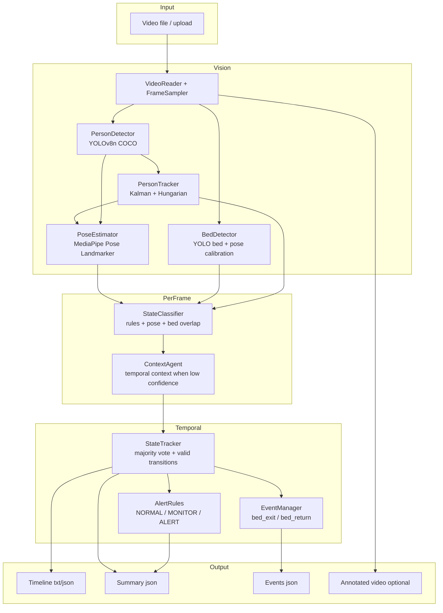

# Elderly Activity Monitoring

Agentic AI + vision pipeline that analyzes continuous indoor video of an elderly person. It tracks **activity states over time**, detects **bed exit / return events**, computes **duration per state**, and produces **NORMAL / MONITOR / ALERT** decisions.

The focus is temporal understanding, pose-based vision, state tracking, and lightweight agentic reasoning—not a production UI.

---

## Architecture



### Data flow (high level)

1. **Sample frames** from the video (default: every 15th frame).
2. **Calibrate bed region** on early frames (YOLO class `bed`, lying-pose clusters, or manual `x1,y1,x2,y2`).
3. **Detect & track** the main person (largest detection, SORT-style tracker).
4. **Estimate pose** (33 landmarks) on the tracked person crop.
5. **Classify** raw state from posture, bed overlap, and movement.
6. **Agent** pulls recent history when confidence is low (e.g. possible bed exit vs. sit-up).
7. **Smooth** states over time and enforce plausible transitions.
8. **Emit** timeline, durations, bed events, and alerts.

### Activity states

| State | Meaning |
|--------|---------|
| `LYING_IN_BED` | Horizontal posture, on/in bed region |
| `SITTING_ON_BED` | Sitting posture, on bed |
| `SITTING_OUTSIDE_BED` | Sitting, off bed (e.g. chair) |
| `STANDING` | Upright, little movement |
| `WALKING` | Upright, sustained displacement |
| `OUT_OF_BED` | Lying/ambiguous off bed (low confidence) |
| `UNKNOWN` | Insufficient evidence |

### Alert logic

| Decision | When |
|----------|------|
| **NORMAL** | Typical lying, sitting, standing, or walking; no prolonged risk signals |
| **MONITOR** | Long edge-of-bed sitting; long `UNKNOWN`; currently out of bed approaching threshold |
| **ALERT** | Longest continuous out-of-bed period exceeds `prolonged_out_of_bed_sec` (default 300s) |

Thresholds live in `backend/core/config.py` (`SystemConfig`).

### Models (no training from scratch)

| Component | Model |
|-----------|--------|
| Person + bed | [Ultralytics YOLOv8n](https://github.com/ultralytics/ultralytics) (`yolov8n.pt`, COCO person=0, bed=59) |
| Pose | [MediaPipe Pose Landmarker Lite](https://developers.google.com/mediapipe) (`pose_landmarker_lite.task`) |
| Tracking | Kalman filter + Hungarian assignment (`filterpy`, `scipy`) |

---

## Requirements

- Python **3.10+** (3.11 recommended)
- Windows / Linux / macOS
- CPU works; GPU speeds up YOLO if available

---

## Setup

```bash
git clone <your-repo-url>
cd deepseek

python -m venv env

# Windows (PowerShell)
.\env\Scripts\Activate.ps1

# Linux / macOS
source env/bin/activate

pip install -r requirements.txt
```

Place or allow auto-download of:

- `yolov8n.pt` — downloaded by Ultralytics on first run if missing
- `pose_landmarker_lite.task` — auto-downloaded by `PoseEstimator` if missing

---

## How to run

All commands assume the virtual environment is active and your shell is in the **project root** (folder containing `run.py` and `backend/`).

### Option 1 — Web UI + API (simple demo)

```bash
python run.py
```

Open **http://localhost:8000**, upload a video, optionally set:

- **Sample interval** — frames between analyses (default `15`)
- **Bed region** — manual override `x1,y1,x2,y2` if auto bed detection is wrong

The server polls `GET /api/results/{job_id}` until analysis completes. Outputs are under `outputs/<job_id>/`.

### Option 2 — CLI (recommended for evaluation & deliverables)

```bash
python run.py analyze path\to\video.mp4
```

Equivalent:

```bash
python -m backend.main path\to\video.mp4
```

**Useful flags:**

```bash
python run.py analyze path\to\video.mp4 ^
  --output-dir outputs\my_run ^
  --sample-interval 15 ^
  --save-annotated ^
  --bed-region 100,200,800,650 ^
  --ground-truth path\to\ground_truth.json
```

| Flag | Description |
|------|-------------|
| `--output-dir` | Directory for JSON, timeline, optional video |
| `--sample-interval` | Process every Nth frame |
| `--save-annotated` | Write `annotated.mp4` with bed box, pose, state label |
| `--bed-region` | Manual bed rectangle in pixels |
| `--ground-truth` | Run evaluation metrics vs. labeled JSON |

### Option 3 — API only

```bash
uvicorn backend.api.app:app --host 0.0.0.0 --port 8000
```

| Endpoint | Method | Purpose |
|----------|--------|---------|
| `/health` | GET | Health check |
| `/api/analyze` | POST | Upload video (`video_file`, `sample_interval`, `bed_region`) |
| `/api/results/{job_id}` | GET | Job status and summary |
| `/api/jobs` | GET | List jobs |

---

## Outputs (deliverables from a run)

After analysis, the output folder contains:

| File | Content |
|------|---------|
| `summary.json` | Durations, bed counts, final state, alert, `bed_region`, events |
| `timeline.txt` | Human-readable segments (`MM:SS – MM:SS  STATE`) |
| `timeline.json` | Same timeline in JSON |
| `events.json` | Bed exit / return events with timestamps |
| `annotated.mp4` | Optional overlay video (`--save-annotated` or web upload) |
| `evaluation.json` | Metrics when `--ground-truth` is provided |

**Example summary fields:** `observation_duration_sec`, `activity_duration_sec`, `bed_exit_count`, `bed_return_count`, `total_in_bed_sec`, `total_out_of_bed_sec`, `longest_out_of_bed_period_sec`, `final_state`, `current_alert`.

---

## Evaluation

Ground-truth JSON format (see `backend/evaluation/metrics.py`):

```json
{
  "duration_sec": 1200,
  "timeline": [{"start_sec": 0, "end_sec": 272, "state": "LYING_IN_BED"}],
  "activity_duration_sec": {"lying_in_bed": 702},
  "bed_exit_count": 2
}
```

Run:

```bash
python run.py analyze video.mp4 --ground-truth labels.json --output-dir outputs/eval_run
```

Reported metrics:

- Frame-level state accuracy (sampled timeline)
- Bed-exit precision / recall / F1
- Per-activity duration error (seconds)

Document **at least three failure cases** (occlusion, sit-up vs. exit, wrong bed region, caregiver in frame, etc.) using annotated clips and timeline snippets from `outputs/`.

---

## Project structure

```
deepseek/
├── run.py                 # Launcher: server or CLI
├── requirements.txt
├── yolov8n.pt             # YOLO weights (or auto-download)
├── pose_landmarker_lite.task
├── frontend/
│   └── index.html         # Minimal upload UI
├── backend/
│   ├── main.py            # Analysis pipeline
│   ├── api/               # FastAPI app & routes
│   ├── vision/            # Detection, pose, bed, tracking
│   ├── state/             # Classifier + temporal tracker
│   ├── agent/             # Context agent + alert rules
│   ├── events/            # Bed exit / return
│   ├── analysis/          # Summary, timeline, durations
│   ├── evaluation/        # Metrics vs. ground truth
│   ├── video/             # Reader & sampler
│   └── core/              # Config & constants
└── outputs/               # Run artifacts (gitignored)
```

---

## Configuration

Edit defaults in `backend/core/config.py`:

- `frame_sample_interval`, `bed_calib_frames`
- Posture angles: `lying_angle_threshold`, `sitting_angle_threshold`
- `walking_movement_ratio` (movement relative to person height)
- Alert: `prolonged_out_of_bed_sec`, `prolonged_edge_sitting_sec`, `prolonged_unknown_sec`

---

## Troubleshooting

| Issue | Suggestion |
|-------|------------|
| Bed box in wrong place | Set **Bed region** in UI or `--bed-region`; use video that shows bed or person lying early |
| Too many `UNKNOWN` segments | Lower sample interval; improve lighting; set bed region |
| Slow first run | YOLO / MediaPipe model load + optional downloads |
| `ModuleNotFoundError: backend` | Run from project root, not inside `backend/` |

---

## License & submission

Add your license and author name before pushing to GitHub. For the assignment, email the repo link to **careers@newnop.com** with subject **ASE AI/ML Assignment – [Your Name]**.

---

## What we would improve with more time

- VLM-based disambiguation for occlusion and caregiver presence  
- Per-camera bed calibration persistence  
- Stronger multi-person handling (elderly vs. caregiver)  
- Automated test videos and CI for regression on timelines and bed events  
